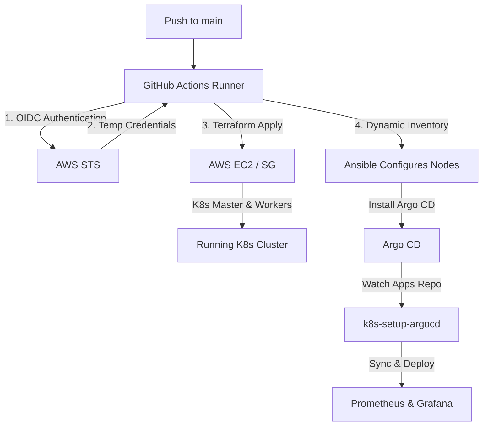
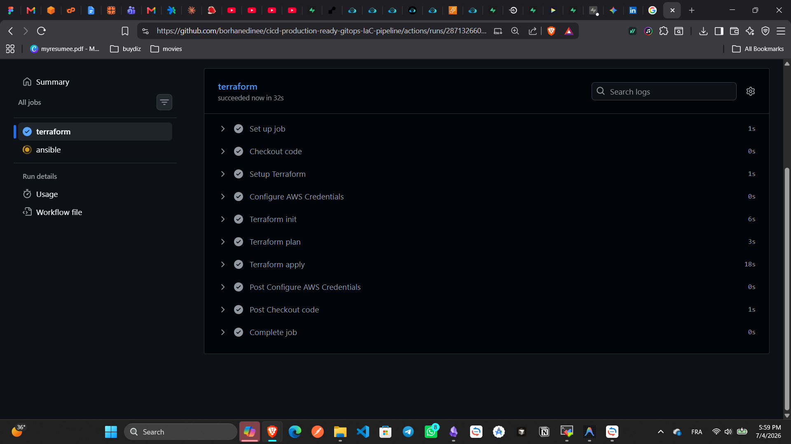
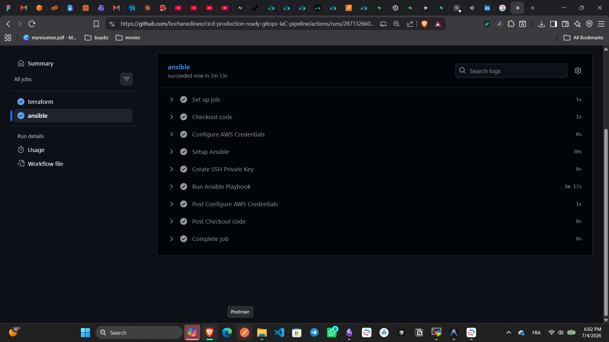
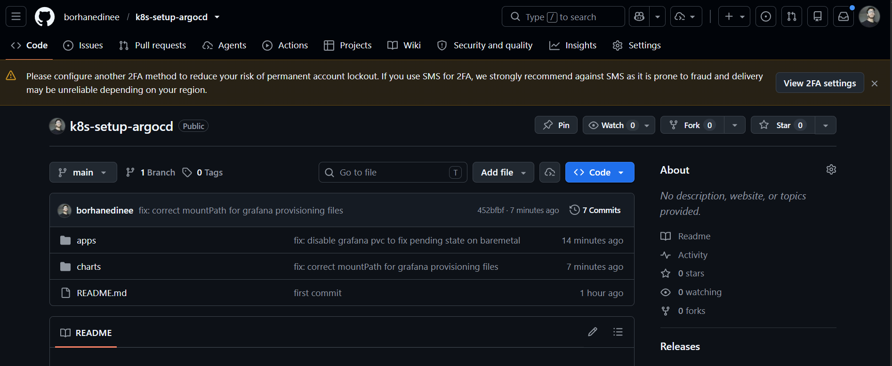
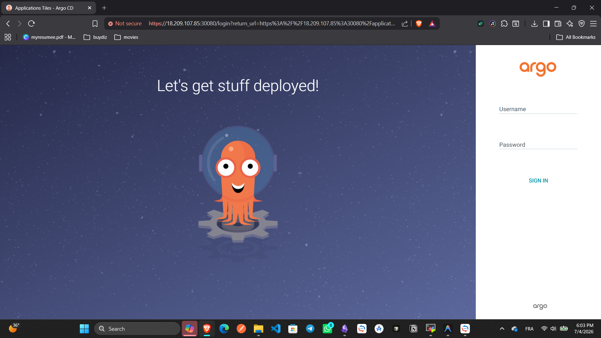
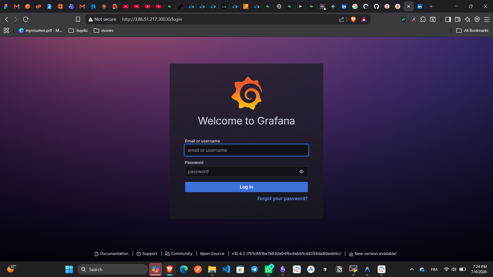
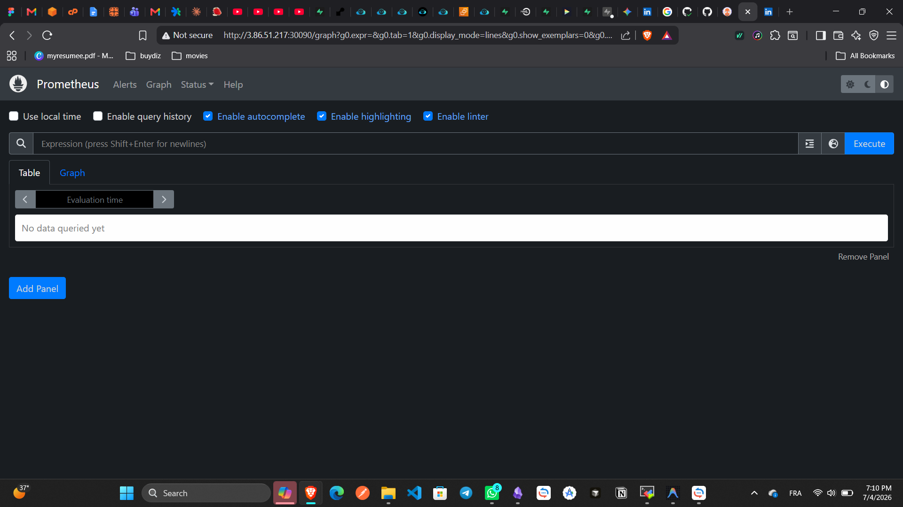

# 🚀 Automated Kubernetes Infrastructure on AWS (GitOps & DevSecOps)

This repository contains a fully automated GitOps pipeline that provisions a Kubernetes (K8s) cluster on AWS EC2 using **Terraform** and configures the control plane and worker nodes using **Ansible**, all managed by **GitHub Actions** CI/CD.

---

## 🏗️ Project Architecture



* **Infrastructure as Code:** [terraform/](file:///c:/Users/Borhan/Desktop/study/gitops/ci-ci-infra-as-code/terraform) provisions the security groups and EC2 instances.
* **Configuration Management:** [ansible/](file:///c:/Users/Borhan/Desktop/study/gitops/ci-ci-infra-as-code/ansible) prepares all nodes, installs container runtimes (containerd), initializes the master node, joins the worker nodes, and installs **Argo CD**.
* **GitOps CI/CD:** [.github/workflows/deploy.yaml](file:///c:/Users/Borhan/Desktop/study/gitops/ci-ci-infra-as-code/.github/workflows/deploy.yaml) connects AWS and GitHub via secure OpenID Connect (OIDC) to run the full build on every push.
* **Continuous Deployment (Two-Repo Architecture):** A separate application repository holds the Helm charts and manifests for Prometheus and Grafana. Argo CD continuously watches this repo and synchronizes the cluster state automatically, cleanly separating infrastructure provisioning from application deployment.

---

## 🔒 Security & Credential Management (OIDC)

Instead of storing long-lived, high-risk `AWS_ACCESS_KEY_ID` and `AWS_SECRET_ACCESS_KEY` credentials in GitHub Secrets, this project uses **OIDC (OpenID Connect)**.
* GitHub Actions requests a temporary JSON Web Token (JWT).
* AWS STS verifies the token against the registered **AWS IAM OIDC Identity Provider**.
* AWS STS assumes the predefined IAM role (`AWS_ROLE_TO_ASSUME`) and grants temporary credentials valid for 1 hour.

---

## 📡 Dynamic Host Discovery with Ansible

To keep the pipeline fully automated, I avoided using a static inventory file with hardcoded IP addresses (which change on every deployment). Instead, I configured Ansible to perform **Dynamic Host Discovery** using the `amazon.aws.aws_ec2` inventory plugin in [aws_ec2.yaml](file:///c:/Users/Borhan/Desktop/study/gitops/ci-ci-infra-as-code/ansible/aws_ec2.yaml).

At runtime, this file connects to AWS using the pipeline's OIDC context and:
* Queries all running EC2 instances in `us-east-1`.
* Dynamically filters and groups the hosts based on their AWS tags (`Role = master` into `aws_role_master`, and `Role = worker` into `aws_role_worker`).
* Configures connection parameters (`ansible_user = ubuntu`) on the fly.

---

## 🛠️ Key Challenges & Solutions

### 🔑 The SSH Private Key Problem in CI/CD
During local development, Terraform generated a new key pair dynamically in-memory and saved it to the local workspace (`secrets/k8s-key.pem`). However, this introduced a critical issue in CI/CD:
1. The generated `.pem` file is correctly git-ignored and never pushed to GitHub.
2. When the `ansible` job runs on the GitHub runner, it does not have access to the private key to log in to the newly created EC2 instances.
3. If Terraform generated a new key on every run in CI, the local key would also lose access.

#### The Temporary Solution:
I updated the EC2 configuration to use a static, pre-created AWS Key Pair named `ci-cd-key`. 
The corresponding private key content was added as a secure, encrypted **GitHub Action Secret** (`SSH_PRIVATE_KEY`). 
During the Ansible execution step, the workflow dynamically recreates the key file on the runner:
```yaml
- name: Create SSH Private Key
  run: |
      mkdir -p ~/.ssh
      echo "${{ secrets.SSH_PRIVATE_KEY }}" > ~/.ssh/k8s-key.pem
      chmod 600 ~/.ssh/k8s-key.pem
```

#### 🛡️ Future Security Upgrades:
While this manual secret injection works, it requires manual copy-pasting of keys. A more robust, highly secure future upgrade will be to use **AWS Secrets Manager** or **HashiCorp Vault** where:
* Terraform automatically uploads the dynamically generated private key to AWS Secrets Manager.
* The Ansible job fetches it dynamically at runtime using AWS OIDC authentication, removing all manual steps and human key handling.


---

## 📸 Pipeline & Deployment Results

Here is the visual walkthrough of the successful automated build:

### 1. Successful GitHub Actions Workflow
The entire sequential pipeline runs successfully. The Ansible job automatically waits for the Terraform job to finish using `needs: terraform`.

<p align="center">
  
</p>

### 2. Terraform & Ansible Job Execution
Terraform successfully provisions the infrastructure and stores state in S3. Ansible automatically connects via dynamic inventory, installs dependencies, configures `kubeadm`/`kubectl`, and registers the workers.

<p align="center">
  
</p>
<p align="center">
  
</p>

### 3. Provisioned AWS Instances
The control plane and worker nodes are successfully provisioned in the AWS EC2 dashboard with their tags.

<p align="center">
  
</p>

### 4. Kubernetes Cluster Operational
The final output showing the master and worker nodes successfully clustered and running.

<p align="center">
  
</p>

### 5. GitOps Continuous Deployment (Argo CD)
Argo CD was configured to watch a separate applications repository (`k8s-setup-argocd`). The UI shows successful synchronization of the monitoring stack.

<p align="center">
  
</p>
<p align="center">
  
</p>

### 6. Monitoring Stack Live
Prometheus and Grafana were successfully deployed by Argo CD and exposed via NodePort, running stably on the cluster.

<p align="center">
  
</p>
<p align="center">
  
</p>

---

## 🚀 How to Run

### 1. Prerequisites
* An AWS Account.
* An OIDC Provider and IAM Role configured in AWS to trust your GitHub repository.
* An S3 bucket (`borhan-terraform-states`) for state storage.

### 2. Configure GitHub Secrets
Add the following secrets to your GitHub repository under **Settings → Secrets and variables → Actions**:
* `AWS_ROLE_TO_ASSUME`: The ARN of your AWS IAM role for OIDC.
* `BACKEND_BUCKET_NAME`: Name of your S3 state bucket.
* `BACKEND_STATE_KEY`: Key/path for your state file.
* `SSH_PRIVATE_KEY`: Content of the private key matching the key pair configured in your EC2 instances.

### 3. Push to Trigger
Simply push your commits to the `main` branch:
```bash
git add .
git commit -m "deploying cluster"
git push origin main
```
